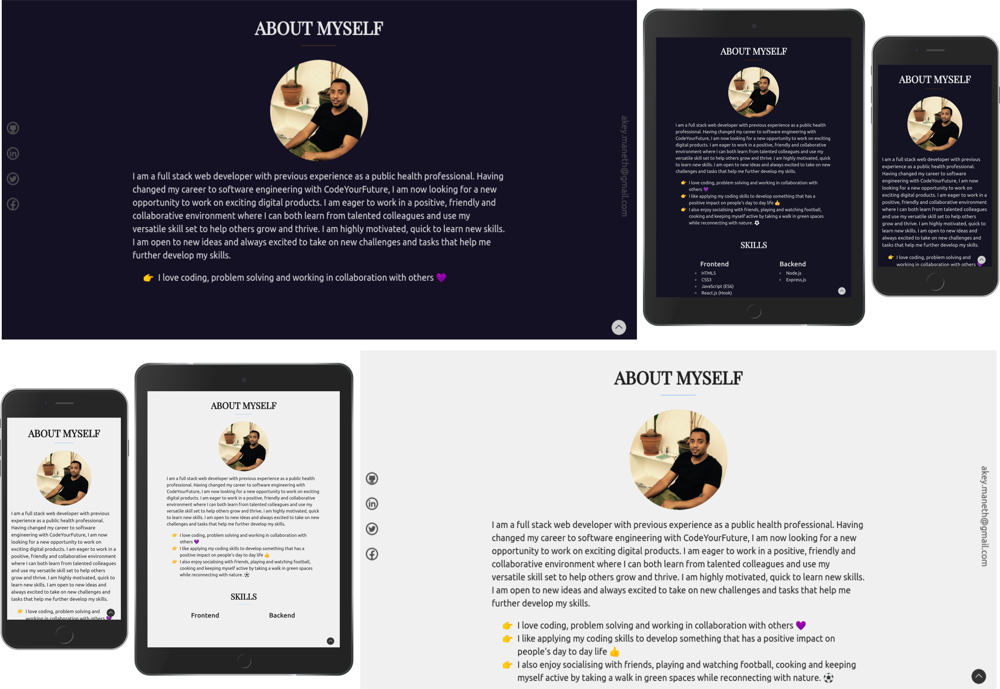
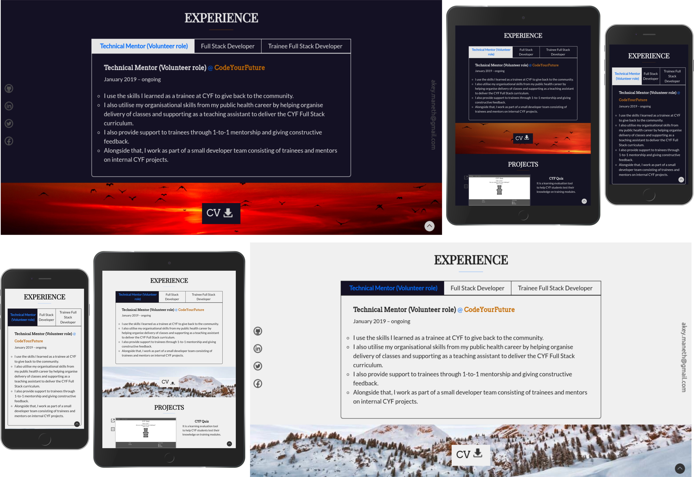
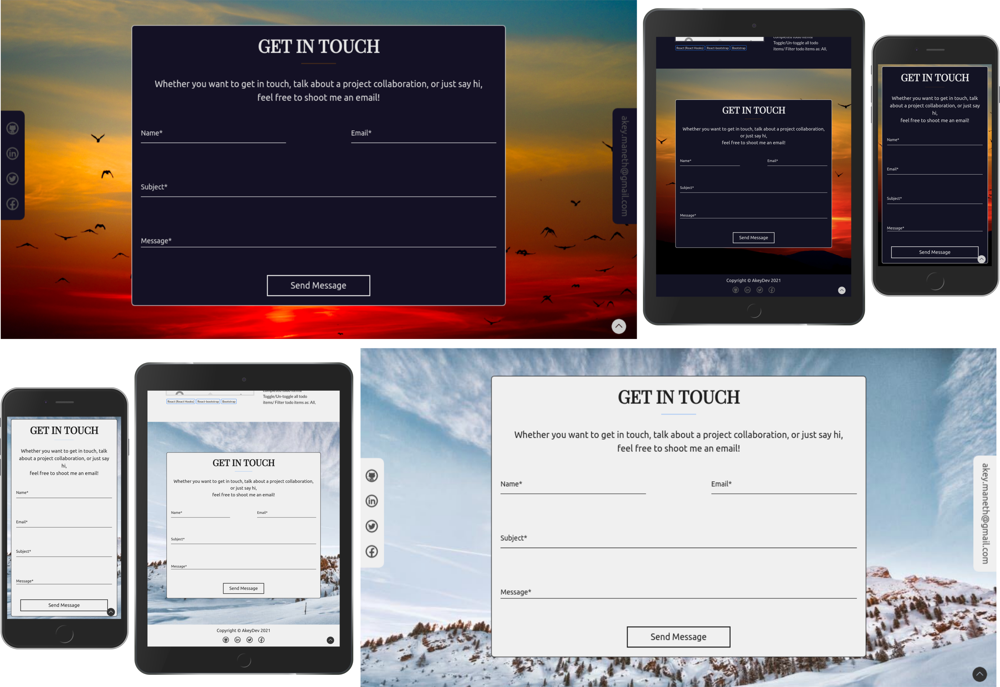

# Akey Personal Portfolio Website

## Table of Contents

1. [Overview](#overview)  
   [1.1. Screenshots of the UI](#screenshots-of-the-ui)  
   [1.2. Live Demo](#live-demo)
2. [Tech Stack](#tech-stack)
3. [Installation](#installation)
4. [Features](#features)
5. [Authors](#authors)
6. [Credits](#credits)

## Overview

This is my personal portfolio website. I created it to give an insight to myself and show a collection of some projects that I completed so far.

### Screenshots of the UI
Screenshots of Desktop, Mobile and Ipad views on dark and light mode:

#### Landing section
<kbd>

</kbd>

#### About section
<kbd>

</kbd>

#### Experience section
<kbd>

</kbd>

#### Projects section
<kbd>

</kbd>

#### Contact section
<kbd>

</kbd>

### Live Demo

Check the app online [here](http://akey-portfolio.web.app/)

## Tech Stack

- [React.js (Hooks)](https://reactjs.org/docs/getting-started.html) for building the user interfaces (UI).
- [React-router-dom](https://reactrouter.com/web/guides/quick-start) for rendering its respective component when its path matches the URL.
- [React-bootstrap](https://react-bootstrap.github.io/) for styling the UI.
- [Bootstrap 4](https://getbootstrap.com) for faster and easier styling of the UI.
- [CSS3](https://www.w3schools.com/cssref) for styling the UI.
- [React-scroll](https://github.com/fisshy/react-scroll) for smooth animating your vertical scrolling.
- [AOS - Animate on scroll library](https://github.com/michalsnik/aos) for animating elements on as you scroll the page.
- [React-transition-group](https://reactcommunity.org/react-transition-group/) for applying transitions to elements entering and leaving the DOM in a declarative and efficient way.
- [React-autosize-textarea](https://github.com/buildo/react-autosize-textarea) for automatically adjust textarea height to match the content.
- [Firebase](https://firebase.google.com/docs/hosting) for hosting the website.
- [Prettier](https://prettier.io/) for formatting the code.

## Installation

```
$ git clone https://github.com/abdulkadiret/personal-portfolio
$ cd ../path/to/the/file
$ npm install
$ npm start
```

## Features

- Used Bootstrap to make it 100% responsive
- Used React-scroll to add smooth scrolling to the app
- Used AOS to give a smooth fade-in animation for elements on the page as you scroll the page
- Used React-autosize-textarea to automatically adjusts textarea height to match the content
- Has dark/light mode
- Has a custome 404 page to give users a way out of the error page 

## Authors

I'm Abdulkadir Awel a full stack developer.  
You can get in touch with me on my LinkedIn Profile: [](https://www.linkedin.com/in/abdulkadir-awel-23781a1a4/)  
You can also follow my GitHub Profile to stay updated about my latest projects: [](https://github.com/abdulkadiret)  
If you liked the repo then kindly support it by giving it a star :star:  

## Credits

Thanks to:

[Pexeles](https://www.pexels.com/) for the background images.
[icon8](https://icons8.com/) and [flaticon](https://www.flaticon.com/) for the social media icons.  
[Google Fonts](https://fonts.google.com/) for the fonts.  

